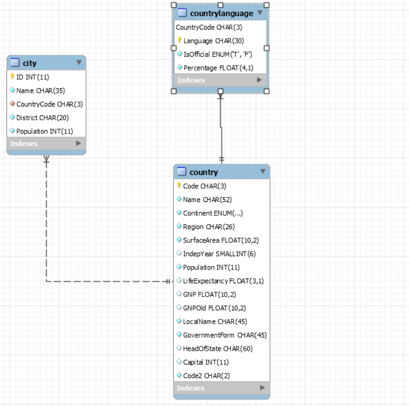

1.Creer de base de données(DB) World
```
$ docker exec --interactive --tty some-mysql mysql --user root -ppassword --execute "create database world;"
```
2.Creer de l'utilisateur voyager avec le mot de passe voyager_1
```
$ docker exec --interactive some-mysql  mysql --user root -ppassword \
     --execute "CREATE USER 'voyager'@'%' IDENTIFIED BY 'voyagers_1';"
 ```
3.Accorder les droits à l'utilisateur d'utiliser la DB world
```
$  docker exec --interactive some-mysql  mysql --user root -ppassword \
  --execute "GRANT ALL ON world.* TO 'voyager'@'%';" 
```

4.Charger la base de données World
```
$ docker exec  --interactive some-mysql  mysql --user root -ppassword world < ~/world.sql
```

5.Charger World dans mysql
```
$ docker exec --interactive --tty some-mysql bash
```

6.Utiliser 
```
mysql> use world;
```

1-Quel est la langue et capital du japon?
```
select countrylanguage.language,city.name
 from 
countrylanguage
inner join country on (countrylanguage.countrycode= country.code) 
inner join city on (country.capital=city.id)
where country.name like 'japan';
```
2-Combien il y a d habitant en italie?
```
select country.name,sum(country.population) as population
 from 
country 
inner join city on (country.code = city.countrycode)
where country.name like 'italia%'
group by country.name;
```

3-Ou est parler l espagnol?
```
select country (population) as population
 from 
country 
inner join countrylanguage = countrylanguage
where language like 'spanish';
```



