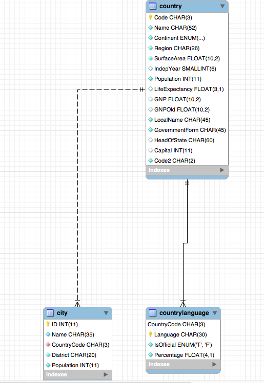

```
1.
$ docker exec --interactive --tty some-mysql mysql --user root -ppassword --execute "create database world;"

2.
$ docker exec --interactive some-mysql  mysql --user root -ppassword \
     --execute "CREATE USER 'voyager'@'%' IDENTIFIED BY 'voyagers_1';"
     
3.
$ docker exec  --interactive some-mysql  mysql --user root -ppassword world < ~/world.sql

4.
$ docker exec  --interactive some-mysql  mysql --user root -ppassword world < ~/world.sql

5.
$ docker exec --interactive --tty some-mysql bash

6.
mysql> use world;
```


mysql> SELECT count(*) FROM country WHERE population like '%'; 

mysql> SELECT count(language) 
FROM countrylanguage 
WHERE language like 'English%' ;

mysql> 
