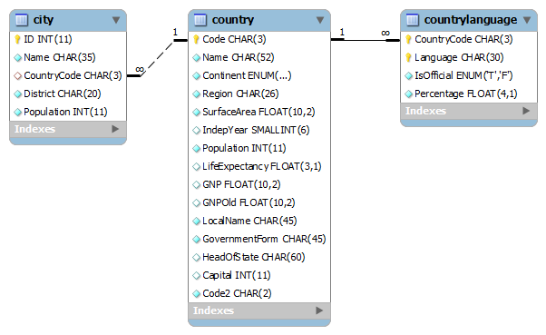

  
World
1.Créer la base de données world
````
docker exec --interactive --tty some-mysql mysql --user root --password --execute "create database world;"
````

2.Créer l'utilisateur voyager avec comme mot de passe voyager_1
````
docker exec --interactive some-mysql  mysql --user root -ppassword --execute "CREATE USER 'voyager'@'%' IDENTIFIED BY 'voyager_1';"
````

3.Donner les droits à l'utilisateur d'utiliser la base de données world
````
$ docker exec --interactive some-mysql  mysql --user root -ppassword --execute "GRANT ALL ON world.* TO 'voyager'@'%';"
````

4.Charger la base de données world
````
$docker exec  --interactive some-mysql  mysql --user root -ppassword world < ~/world.sql
````
5.Les requettes
  5.1 1ère requette
````
SELECT  country.IndepYear AS AnnéeIndépendance, country.Name AS Pays
FROM
country
WHERE country.Name LIKE 'algeria';
````
  5.2 2ème requette
````
SELECT  countrylanguage.Language AS Langue , SUM(country.Population) AS NombreHabitants
FROM
country
INNER JOIN countrylanguage ON (countrylanguage.CountryCode = country.code) 
WHERE countrylanguage.Language LIKE 'Arabic' and country.Name LIKE 'Morocco'
GROUP BY countrylanguage.Language;
````
5.3 3ème requette
````
SELECT  countrylanguage.Language AS Langue , SUM(city.Population) AS NombreHabitants
FROM
city
INNER JOIN country ON (country.Code = city.CountryCode)
INNER JOIN countrylanguage ON (countrylanguage.CountryCode = country.code) 
WHERE countrylanguage.Language LIKE 'Arabic' and city.Name LIKE 'Casablanca'
GROUP BY countrylanguage.Language;
````
6.Afficher le schéma 




