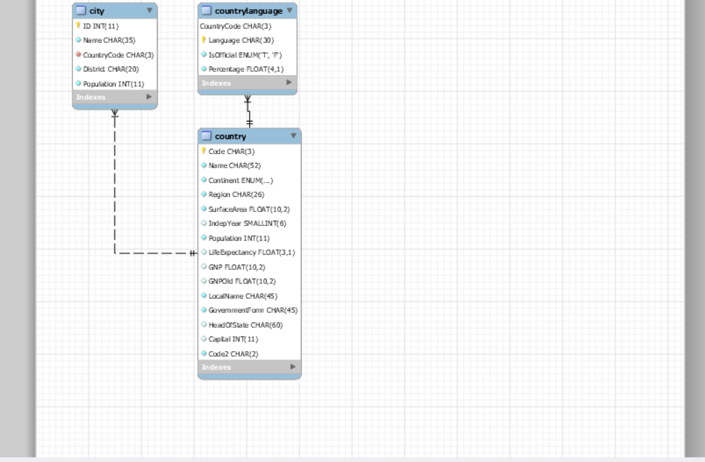

###creation de la base de données world
```
$ docker exec --interactive --tty some-mysql mysql --user root --password --execute "create database world;"
```
###creation l'utilisateur voyager avec comme mot de passe voyager_1
```
$ docker exec --interactive some-mysql  mysql --user root -ppassword \
    --execute "CREATE USER 'voyager'@'%' IDENTIFIED BY 'voyager_1';"
```    
 #Donner les droits à l'utilisateur d'utiliser la base de données world
 ```
 $ docker exec --interactive some-mysql  mysql --user root -ppassword \
   --execute "GRANT ALL ON world.* TO 'voyager'@'%';" 
 ```
 #charger la base de données world
 ```
 $docker exec  --interactive some-mysql  mysql --user root -ppassword world < ~/world.sql  
 ```
 changer the database dans mysql
 ```
 $ docker exec --interactive --tty some-mysql bash
 mysql> use world;
```

#Les requetes:
```
mysql>select c.Language, d.Code
 from 
countrylanguage c
inner join country d on d.code = c.CountryCode
where Language like 'English%' ;
```

```
msql>Select c.Name AS city, sum(d.Population) 
 from 
city c

inner join city c on d.name = c.name
inner join country d on d.Population = c.Population
  
where city='Kabul'
group by c.Name
having sum(d.Population) > 273000; 
```

```

```


