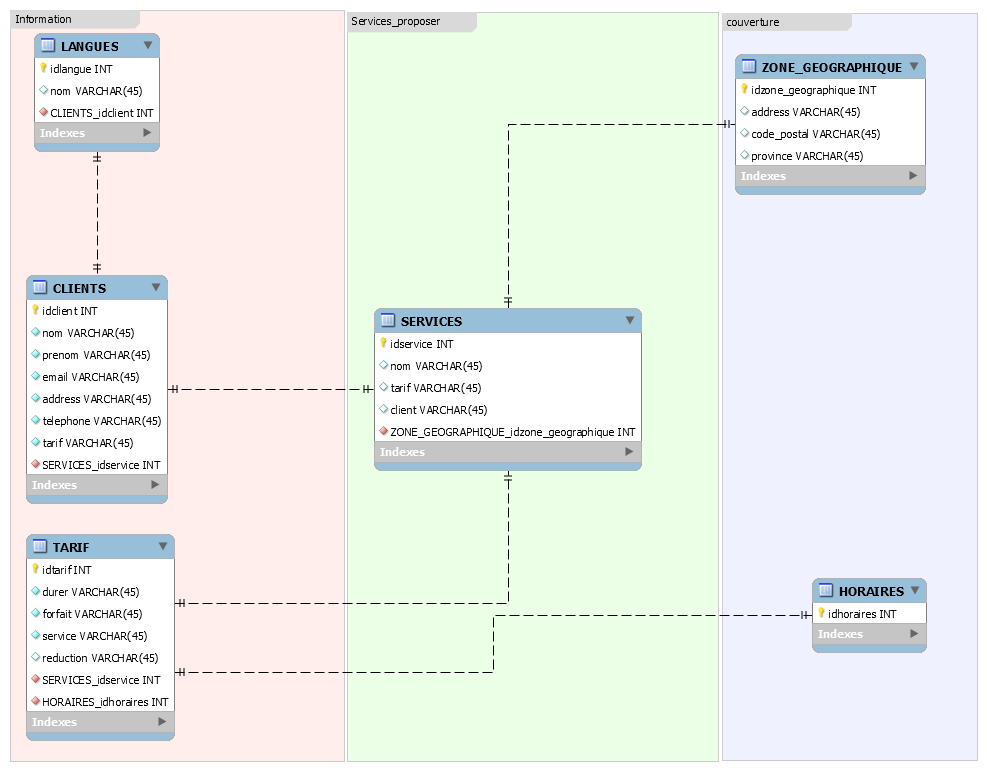

1-Creation de la base de donnee services_personnes

```docker exec --interactive --tty some-mysql mysql --user root --password --execute "create database service;"```

2-Créer un utilisateur
```docker exec --interactive some-mysql  mysql --user root -ppassword \ --execute "CREATE USER 'paul'@'%' IDENTIFIED BY 'paul1';" ```

3-Accorder tous les drois a l'utilisateur d'utiliser la base 
   ```docker exec --interactive some-mysql  mysql --user root -ppassword   --execute "GRANT ALL ON service* TO 'paul'@'%';"```
   
4-Charger la base
```docker exec  --interactive some-mysql  mysql --user root -ppassword service < ~/service.sql ```

5-Charger les données
 

