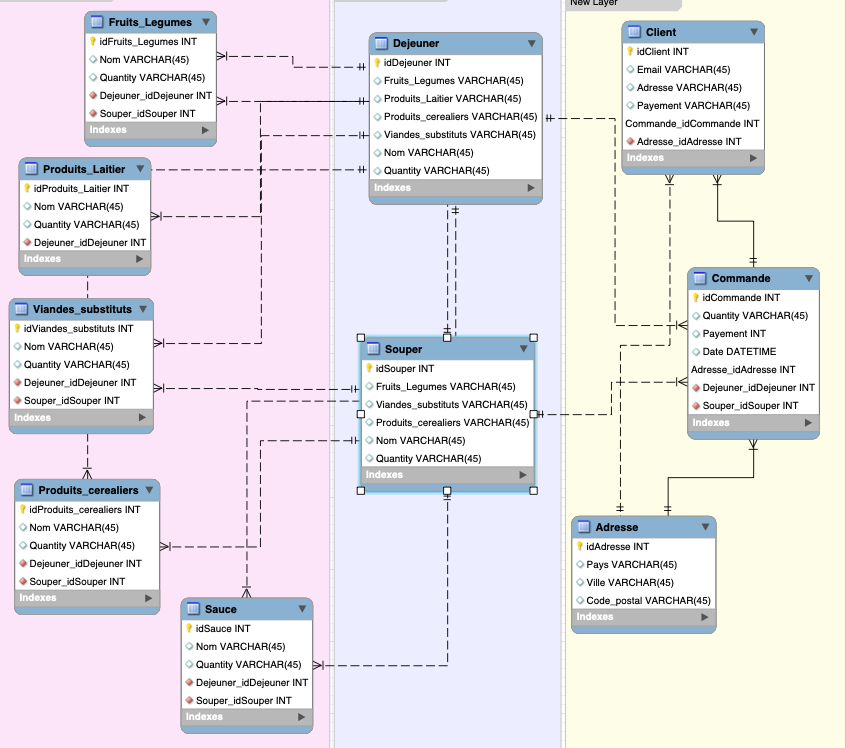

## Création de la base de données Made with love (mwl_schema)
```
$ docker exec --interactive --tty some-mysql mysql --user root --password --execute "create database mwl_schema;"
```
### Création de l'utilisateur pour la base de données ayant comme nom mwl et avec mot de passe mwl_1
```
$ docker exec --interactive some-mysql  mysql --user root -ppassword \
    --execute "CREATE USER 'mwl'@'%' IDENTIFIED BY 'mwl_1';"
```
 ### Accorder tout les droits à l'utilisateur d'utiliser la base de données mwl_schema
 ```
 $ docker exec --interactive some-mysql  mysql --user root -ppassword \
   --execute "GRANT ALL ON mwl_schema.* TO 'mwl'@'%';" 
```
### Charger la base de données Made with love
```
$ docker exec  --interactive some-mysql  mysql --user root -ppassword password < ~/madewithlove.sql
```
### Changer la base de données dans MYSQL
```

```


