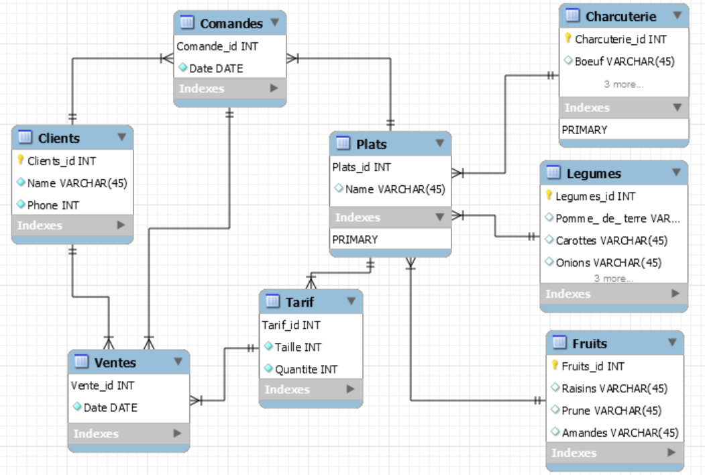

Création de la base de données MyResto
````
$docker exec --interactive --tty some-mysql mysql --user root --password --execute "create database MyResto;"
````
Charger la base de données MyResto
````
$ docker exec  --interactive some-mysql  mysql --user root -ppassword MyResto < ~/Developer/INF1006-202-18A-02/5.CIF/300107710/MyResto.sql 
````

charger la database MyResto dans mysql

````
$docker exec --interactive --tty some-mysql bash
mysql> mysql -u root -p ;
password: password
mysql> use MyResto;
````

Schema




