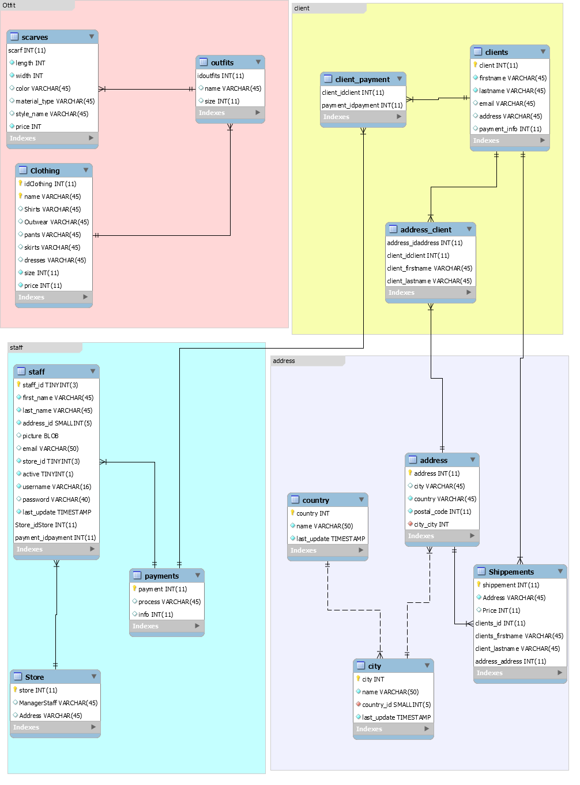

# creation de la base de données fashion
```
$ docker exec --interactive --tty some-mysql mysql --user root --password --execute "create database fashion;"
```
## creation l'utilisateur fash avec comme mot de passe fash_1
```
$ docker exec --interactive some-mysql  mysql --user root -ppassword \
    --execute "CREATE USER 'fash'@'%' IDENTIFIED BY 'fash_1';"
```    
 ## Donner les droits à l'utilisateur d'utiliser la base de données fashion
 ```
 $ docker exec --interactive some-mysql  mysql --user root -ppassword \
   --execute "GRANT ALL ON fashion.* TO 'fash'@'%';" 
 ```
 ### charger la base de données fashion
 ```
 $docker exec  --interactive some-mysql  mysql --user root -ppassword world < ~/fashion.sql  
 ```
 changer the database dans mysql
 ```
 $ docker exec --interactive --tty some-mysql bash
 mysql> mysql -u root -p ;
 password: password
 mysql> use fashion;
```


